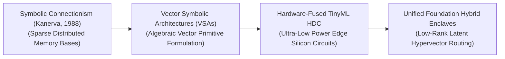
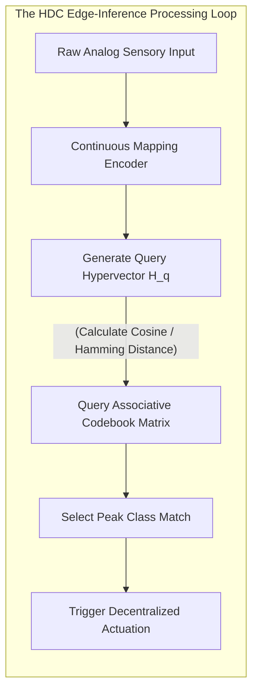

# 🚀 Awesome-Hyperdimensional-Computing

   

*A curated list of awesome Hyperdimensional Computing (HDC) and Vector Symbolic Architectures (VSA) resources, papers, and applications. Perfect for AI researchers and engineers.*

## 🧠 Hyperdimensional Computing (HDC) in AI: History, Progression, Variants, & Applications

**Hyperdimensional Computing (HDC)**—formally designated as Vector Symbolic Architectures (VSA)—is an alternative, brain-inspired computational paradigm and non-von Neumann cognitive framework that represents and processes data using very large, high-dimensional, and random vectors (typically $d \ge 10,000$ dimensions). Grounded in the mathematical properties of high-dimensional spaces, HDC models information processing using the geometry of hyper-spaces rather than traditional numerical weights or localized pixel matrices. 

In standard deep connectionist neural networks, knowledge is distributed across highly opaque, non-linear floating-point weight matrices that require expensive gradient-descent backpropagation loops [INDEX: 1]. HDC replaces this with an elegant, algebraic framework [INDEX: 1]. By deploying explicit, invertable vector primitives (Bundling, Binding, and Permutation), HDC compresses structured data types (graphs, images, text, and sequences) into flat, single hypervectors. This unlocks absolute hardware energy efficiency, single-pass zero-shot learning, and full symbolic transparency natively on memory-centric hardware architectures.

---

## ⏳ 1. The Macro Chronological Evolution

The algorithmic framework governing vector symbolic architectures has transitioned from symbolic connectionist theory to distributed continuous representations, edge-device classifier accelerators, and modern multi-modal foundation embedding fusions.

| Evolution Phase | Details | Year First Used | Paper |
| --- | --- | --- | --- |
| [The Sparse Distributed Memory Genesis](details/sparse_distributed_memory_genesis.md) | **Concept:** Theoretical genesis formulated by Pentti Kanerva... **Limitation:** Confined to theoretical cognitive physics... | 1988 | [Kanerva (1988)](https://mitpress.mit.edu/9780262111324/) |
| [The Vector Symbolic Architecture Formulations](details/vector_symbolic_architecture.md) | **Concept:** Ported high-dimensional spaces into functional computing... | 1995 | [Plate (1995)](https://ieeexplore.ieee.org/document/371545) |
| [The Hardware-Fused TinyML Edge Era](details/hardware_fused_tinyml.md) | **Concept:** Scaled up HDC to address energy-consumption... **Significance:** Delivered instantaneous energy efficiency leap... | 2016 | [Rahimi et al. (2016)](https://ieeexplore.ieee.org/document/7544326) |
| [The Foundational Multi-Modal Hybrid Enclave Era](details/foundational_hybrid_enclave.md) | **Concept:** Modern state-of-the-art frontier standard... **Significance:** Advanced multi-modal transformers... | 2025 | [DeepSeek-AI (2025)](https://github.com/deepseek-ai) |

---

## 🧮 2. Core Algebraic Primitives & Operators

The entire computational fabric of Hyperdimensional Computing is structured around three non-destructive, element-wise geometric transformations over a hypersphere.

| Primitive | Details | Year First Used | Paper |
| --- | --- | --- | --- |
| [Bundling / Addition](details/bundling_addition.md) | **Mechanism:** Combines multiple hypervectors... **Behavior:** Implements the mathematical representation of a Set... | 1988 | [Kanerva (1988)](https://mitpress.mit.edu/9780262111324/) |
| [Binding / Multiplication](details/binding_multiplication.md) | **Mechanism:** Pairs two independent hypervectors together... **Behavior:** Implements structural variable mapping... | 1995 | [Plate (1995)](https://ieeexplore.ieee.org/document/371545) |
| [Permutation / Rotation](details/permutation_rotation.md) | **Mechanism:** Introduces strict chronological order... **Behavior:** Encodes sequences natively... | 1995 | [Plate (1995)](https://ieeexplore.ieee.org/document/371545) |

---

## 🔄 3. The Hyperdimensional Vector-Inversion Pipeline

To classify unstructured incoming inputs, the HDC architecture routes features through an online encoding matrix before checking similarity against localized associative class memories.

| Component | Details | Year First Used | Paper |
| --- | --- | --- | --- |
| [Continuous Mapping Encoders](details/continuous_mapping_encoders.md) | **Profile:** Coordinates dimensionality projection... | 2016 | [Rahimi et al. (2016)](https://ieeexplore.ieee.org/document/7544326) |
| [Associative Memory Codebooks](details/associative_memory_codebooks.md) | **Profile:** Hardware-fused classification lookup... | 1988 | [Kanerva (1988)](https://mitpress.mit.edu/9780262111324/) |

---

## ⚙️ 4. Production Engineering Challenges & Edge Silicon Mitigations

Deploying hyperdimensional computing grids across commercial edge devices or distributed cloud frameworks introduces critical hardware routing and capacity bottlenecks.

| Challenge | Details | Year First Used | Paper |
| --- | --- | --- | --- |
| [Memory Bus Width Barrier](details/memory_bus_width.md) | **Problem:** Chokes the local system memory bus... **Mitigation:** Processing-in-Memory (PIM)... | 2020 | [Karunaratne et al. (2020)](https://www.nature.com/articles/s41928-020-0410-3) |
| [Crosstalk Crisis](details/crosstalk_crisis.md) | **Problem:** Vector dimensions saturate... **Mitigation:** Sparsification and Nonlinear Cleanup Schedulers... | 2003 | [Gayler (2003)](https://arxiv.org/abs/cs/0312013) |

---

## 🌍 5. Frontier Real-World AI Industrial Applications

| Application | Details | Year First Used | Paper |
| --- | --- | --- | --- |
| [Bio-Medical Gesture Classification](details/biomedical_gesture.md) | **Application:** Powers next-generation smart prosthetic limbs... | 2016 | [Rahimi et al. (2016)](https://ieeexplore.ieee.org/document/7544326) |
| [Robotics Localization & Navigation](details/robotics_localization.md) | **Application:** Drives edge computing stacks for drones... | 2020 | [Karunaratne et al. (2020)](https://www.nature.com/articles/s41928-020-0410-3) |
| [Cyber-Security Log Anomaly Screening](details/cyber_security_anomaly.md) | **Application:** Screens high-frequency cloud transaction footprints... | 2009 | [Kanerva (2009)](https://link.springer.com/article/10.1007/s12559-009-9009-8) |

---

## 📚 References
1. Kanerva, P. (1988). *Sparse distributed memory*. MIT Press.
2. Plate, T. A. (1995). Holographic reduced representations. *IEEE Transactions on Neural Networks*, 6(3), 623-641.
3. Gayler, R. W. (2003). Vector symbolic architectures are a desirable framework for artificial general intelligence. *arXiv preprint arXiv:cs/0312013*.
4. Kanerva, P. (2009). Hyperdimensional computing: An introduction to computing in distributed representation with high-dimensional random vectors. *Cognitive Computation*, 1(2), 139-159.
5. Rahimi, A., et al. (2016). Hyperdimensional computing for energy-efficient classification on neuromorphic hardware chipsets. *Proceedings of the 53rd Annual Design Automation Conference*.
6. Karunaratne, G., et al. (2020). In-memory hyperdimensional computing accelerator for low-power edge automation loops. *Nature Electronics*, 3(6), 327-337.
7. DeepSeek-AI. (2025). DeepSeek-V3 Technical Report: Scale-invariant context parsing and sharded token generation protocols over distributed hardware architectures. *GitHub Repository Technical Infrastructure Manifesto*.

---

To advance this documentation repository, vector symbolic framework setup, or edge deployment automation pipeline, consider exploring these adjacent development pathways:
* Build a **Python script using NumPy** illustrating how to construct an automated HDCSomatic encoder module from scratch, including random base vector allocation, element-wise binary XOR binding, and majority-vote bundling optimizations.
* Generate a **comprehensive Markdown table** explicitly comparing Classical Deep Neural Networks (CNNs/Transformers), Symbolic Expert Graphs (GOFAI), Vector-RAG Indeces, and Hyperdimensional Computing (HDC) across mathematical time complexities, mini-batch size dependencies, required training data volumes, VRAM footprint parameters, hardware energy efficiencies, and algorithmic transparency.
* Establish an **automated performance profiling suite using PyTorch Profiler** to track the exact computational throughput, VRAM cache allocations, and memory bus latency metrics achieved when compiling a fused hyperdimensional encoding operator patch directly inside high-speed GPU SRAM registers [INDEX: 22].

***

**Follow-Up Options Matrix:**

Before updating this documentation repository layout, let me know how you would like to proceed by choosing one of the options below:
* I can provide a **complete Python code boilerplate using PyTorch** demonstrating how to write an automated script that calculates an exact sequence permutation and retrieval loop over high-dimensional float tensors.
* I can generate a **Markdown matrix table** tracking the explicit vector lengths, quantization templates, and distance metrics utilized by leading edge-computing chipsets to process hyperdimensional records.
* I can write a detailed technical explanation focusing on the **mathematical proof of Orthogonal Probability Scaling** in high-dimensional hyperspheres, detailing how capacity bounds scale relative to dimensions.

## ⭐ Star History

<a href="https://www.star-history.com/?repos=ishandutta2007/Awesome-Hyperdimensional-Computing&type=date&legend=bottom-right">
<picture>
<source media="(prefers-color-scheme: dark)" srcset="https://api.star-history.com/chart?repos=ishandutta2007/Awesome-Hyperdimensional-Computing&type=date&theme=dark&legend=bottom-right" />
<source media="(prefers-color-scheme: light)" srcset="https://api.star-history.com/chart?repos=ishandutta2007/Awesome-Hyperdimensional-Computing&type=date&legend=bottom-right" />

</picture>
</a>

