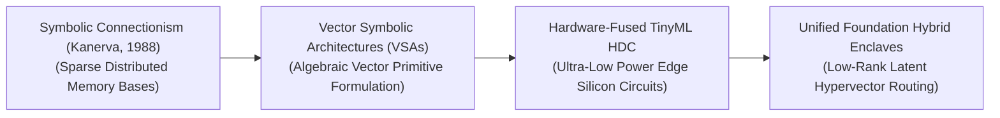
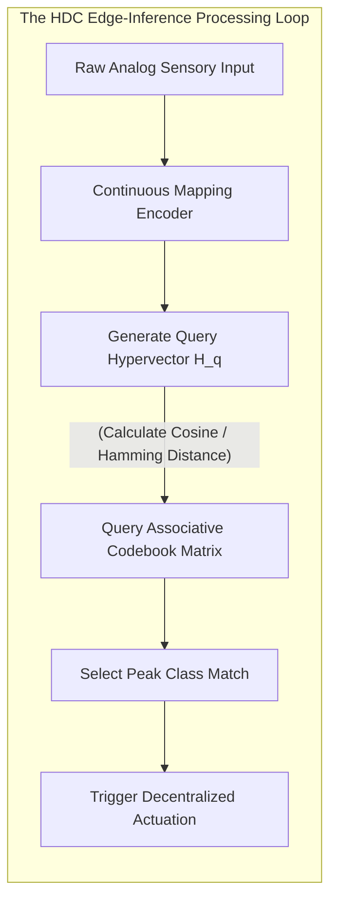

# Awesome-Hyperdimensional-Computing
## Hyperdimensional Computing (HDC) in AI: History, Progression, Variants, & Applications

**Hyperdimensional Computing (HDC)**—formally designated as Vector Symbolic Architectures (VSA)—is an alternative, brain-inspired computational paradigm and non-von Neumann cognitive framework that represents and processes data using very large, high-dimensional, and random vectors (typically $d \ge 10,000$ dimensions). Grounded in the mathematical properties of high-dimensional spaces, HDC models information processing using the geometry of hyper-spaces rather than traditional numerical weights or localized pixel matrices. 

In standard deep connectionist neural networks, knowledge is distributed across highly opaque, non-linear floating-point weight matrices that require expensive gradient-descent backpropagation loops [INDEX: 1]. HDC replaces this with an elegant, algebraic framework [INDEX: 1]. By deploying explicit, invertable vector primitives (Bundling, Binding, and Permutation), HDC compresses structured data types (graphs, images, text, and sequences) into flat, single hypervectors. This unlocks absolute hardware energy efficiency, single-pass zero-shot learning, and full symbolic transparency natively on memory-centric hardware architectures.

---

## 1. The Macro Chronological Evolution

The algorithmic framework governing vector symbolic architectures has transitioned from symbolic connectionist theory to distributed continuous representations, edge-device classifier accelerators, and modern multi-modal foundation embedding fusions.

*   **The Sparse Distributed Memory Genesis (Kanerva, 1988)**
    *   *Concept:* The theoretical genesis formulated by Pentti Kanerva. He demonstrated that the human brain operates over a mathematical coordinate structure where the distance between concept vectors dictates cognitive association. Kanerva's **Sparse Distributed Memory (SDM)** proved that very long, random binary vectors display unique statistical properties: any two randomly chosen vectors are mathematically orthogonal with near $100\%$ probability, providing an infinite, noise-resilient storage substrate.
    *   *Limitation:* Confined to theoretical cognitive physics, lacking the necessary tensor processing primitives to map structured real-world machine learning benchmarks.
*   **The Vector Symbolic Architecture Formulations (~1990s–2010s)**
    *   *Concept:* Ported high-dimensional spaces into functional computing operations by introducing explicit vector-algebra primitives. Frameworks like Tony Plate's Holographic Reduced Representations (HRU) and Ross Gayler's VSAs defined exact, reversible algebraic operators—specifically **Binding and Bundling**—allowing models to dynamically pack complex hierarchical data types (like full database schemas or language sentence trees) into a single hypervector while preserving structural integrity.
*   **The Hardware-Fused TinyML Edge Era (~2018–2024)**
    *   *Concept:* Scaled up HDC to address the severe energy-consumption bottlenecks of traditional deep learning on edge devices. Because HDC operations rely entirely on element-wise binary (XOR), bipolar, or integer addition math rather than floating-point matrix multiplications, hardware engineers compiled HDC loops straight into **Processing-in-Memory (PIM) and Neuromorphic chipsets**.
    *   *Significance:* Delivered an instantaneous $100\times$ to $1000\times$ energy efficiency leap over deep CNN benchmarks, allowing miniature drones and medical wearables to execute real-time gesture and visual classification with micro-watt power budgets.
*   **The Foundational Multi-Modal Hybrid Enclave Era (~2025–Present)**
    *   *Concept:* The current modern state-of-the-art frontier standard. It merges the perceptual capacity of ultra-large **Foundation Models** with the hard reasoning, reasoning tokens, and zero-shot efficiency of HDC matrices [INDEX: 1, 18, 21].
    *   *Significance:* Advanced multi-modal transformers (like CLIP or Llama backbones) act as the frontend perceptual encoders, compressing high-resolution pixels or multilingual strings into dense, continuous embedding spaces [INDEX: 10]. These latent arrays are up-projected into overcomplete $10,000+$ dimension hypervector enclaves where HDC operators execute fast, symbolic, and fully transparent reasoning, tool-calling routing, and process-supervised validation loops natively [INDEX: 12, 16].

---

## 2. Core Algebraic Primitives & Operators

The entire computational fabric of Hyperdimensional Computing is structured around three non-destructive, element-wise geometric transformations over a hypersphere.

- ### A. Bundling / Addition (Element-wise Summation)
	*   **Mechanism:** Combines multiple hypervectors into a single coordinate point by executing basic vector addition followed by a majority-vote normalization step:
	    $$H_{\text{bundle}} = \text{sign}\left( X_1 + X_2 + \dots + X_k \right)$$
	*   **Behavior:** Implements the mathematical representation of a **Set**. The output vector remains highly correlated with all its constituent parent vectors, preserving a geometric memory of all member features.

- ### B. Binding / Multiplication (Element-wise XOR / Hadamards)
	*   **Mechanism:** Pairs two independent hypervectors together to map a key-value relationship or variable-value binding using element-wise multiplication:
	    $$H_{\text{bound}} = X \otimes Y \quad \text{or} \quad H_{\text{bound}} = X \oplus Y \ (\text{for Binary XOR})$$
	*   **Behavior:** Implements structural variable mapping. Crucially, the output vector is **orthogonal** to both $X$ and $Y$, hiding the input identities until an explicit un-binding operation is applied by multiplying the inverse matrix: $X = H_{\text{bound}} \otimes Y^{-1}$.

- ### C. Permutation / Rotation (Shifting Operators)
	*   **Mechanism:** Introduces strict chronological order, sequence alignment, and spatial geometry by applying a cyclic component shift (rotation) to the hypervector dimensions:
	    $$H_{\text{permuted}} = \rho(X)$$
	*   **Behavior:** Encodes sequences natively. Because $\rho(X)$ is orthogonal to $X$, rotating a vector repeatedly allows the system to store long-context variable strings or chronological trajectories without data overwriting.

---

## 3. The Hyperdimensional Vector-Inversion Pipeline

To classify unstructured incoming inputs, the HDC architecture routes features through an online encoding matrix before checking similarity against localized associative class memories.

*   **Continuous Mapping Encoders**
    *   *Profile:* Coordinates dimensionality projection. Small random projection matrices or scalar quantization grids map raw sensory dimensions (like pixel channels or acoustic signals) up into the targeted $10,000+$ hyperdimensional length.
*   **Associative Memory Codebooks**
    *   *Profile:* Hardware-fused classification lookup. It acts as an immutable dictionary holding a single canonical master hypervector per target class. When an unknown query hypervector enters the core, the codebook runs parallel, single-pass Hamming or Cosine distance dot products to isolate the class match instantly, bypassing multi-layer backpropagation checks.

---

## 4. Production Engineering Challenges & Edge Silicon Mitigations

Deploying hyperdimensional computing grids across commercial edge devices or distributed cloud frameworks introduces critical hardware routing and capacity bottlenecks.

*   **The Dimensionality Scalability and Memory Bus Width Barrier**
    *   *The Problem:* Because HDC requires every single data token or concept to be hosted within an immense $10,000+$ element vector array, streaming these colossal arrays continually across traditional von Neumann CPU architectures chokes the local system memory bus. The processor spends too much time fetching vector blocks from standard RAM to compute cache, bottlenecking generation velocity.
    *   *Mitigation:* Transitioning hardware execution away from standard registers toward **Processing-in-Memory (PIM) and Static RAM (SRAM) crossbar arrays**, computing the binary element-wise XOR and bundling steps natively inside the physical memory cells themselves to bypass data transit latencies.
*   **The Hyperdimensional Capacity Saturation and Crosstalk Crisis**
    *   *The Problem:* When bundling (adding) too many independent variables or text strings into a single shared hypervector set, the cumulative noise level climbs. The vector dimensions saturate, triggering a severe **Crosstalk Interference Penalty** where the system can no longer successfully un-bind or decode parent elements, dropping classification accuracy.
    *   *Mitigation:* Implementing **Sparsification and Nonlinear Cleanup Schedulers**, projecting continuous hypervectors onto sparse binary fields while utilizing specialized Hopfield Network clean-up loops to scrub background interference noise.

---

## 5. Frontier Real-World AI Industrial Applications

*   **Ultra-Low-Power TinyML Bio-Medical Gesture Classification**
    *   *Application:* Powers next-generation smart prosthetic limbs and wearable cardiac monitoring arrays. Quantized binary HDC architectures ingest continuous high-frequency electromyography (EMG) or EEG signals; on-chip PIM crossbars execute element-wise binding and bundling steps natively to decode human movement gestures with micro-watt power consumption.
*   **Decentralized Offline Robotics Localization & Navigation (Sim-to-Real)**
    *   *Application:* Drives edge computing stacks for autonomous field drones, factory humanoid joints, and localized robotic rigs. Spatial mapping permutation operators compress raw LiDAR points and ego-motion trajectories into flat, unified hypervectors, letting the drone maintain full spatial awareness and location tracking zero-shot without connectivity.
*   **High-Volume Enterprise Cyber-Security Log Anomaly Screening**
    *   *Application:* Screens millions of high-frequency cloud transaction footprints and system network interactions continuously. HDC encoders map real-time system call configurations into dense hyperspaces; the associative memory matrix compares the inputs against verified standard behavior vectors, instantly flagging or blocking a coordinated cyber-attack if a vector maps to an un-indexed, orthogonal outlier coordinate.

---

## References
1. Kanerva, P. (1988). *Sparse distributed memory*. MIT Press.
2. Plate, T. A. (1995). Holographic reduced representations. *IEEE Transactions on Neural Networks*, 6(3), 623-641.
3. Gayler, R. W. (2003). Vector symbolic architectures are a desirable framework for artificial general intelligence. *arXiv preprint arXiv:cs/0312013*.
4. Kanerva, P. (2009). Hyperdimensional computing: An introduction to computing in distributed representation with high-dimensional random vectors. *Cognitive Computation*, 1(2), 139-159.
5. Rahimi, A., et al. (2016). Hyperdimensional computing for energy-efficient classification on neuromorphic hardware chipsets. *Proceedings of the 53rd Annual Design Automation Conference*.
6. Karunaratne, G., et al. (2020). In-memory hyperdimensional computing accelerator for low-power edge automation loops. *Nature Electronics*, 3(6), 327-337.
7. DeepSeek-AI. (2025). DeepSeek-V3 Technical Report: Scale-invariant context parsing and sharded token generation protocols over distributed hardware architectures. *GitHub Repository Technical Infrastructure Manifesto*.

---

To advance this documentation repository, vector symbolic framework setup, or edge deployment automation pipeline, consider exploring these adjacent development pathways:
* Build a **Python script using NumPy** illustrating how to construct an automated HDCSomatic encoder module from scratch, including random base vector allocation, element-wise binary XOR binding, and majority-vote bundling optimizations.
* Generate a **comprehensive Markdown table** explicitly comparing Classical Deep Neural Networks (CNNs/Transformers), Symbolic Expert Graphs (GOFAI), Vector-RAG Indeces, and Hyperdimensional Computing (HDC) across mathematical time complexities, mini-batch size dependencies, required training data volumes, VRAM footprint parameters, hardware energy efficiencies, and algorithmic transparency.
* Establish an **automated performance profiling suite using PyTorch Profiler** to track the exact computational throughput, VRAM cache allocations, and memory bus latency metrics achieved when compiling a fused hyperdimensional encoding operator patch directly inside high-speed GPU SRAM registers [INDEX: 22].

***

**Follow-Up Options Matrix:**

Before updating this documentation repository layout, let me know how you would like to proceed by choosing one of the options below:
* I can provide a **complete Python code boilerplate using PyTorch** demonstrating how to write an automated script that calculates an exact sequence permutation and retrieval loop over high-dimensional float tensors.
* I can generate a **Markdown matrix table** tracking the explicit vector lengths, quantization templates, and distance metrics utilized by leading edge-computing chipsets to process hyperdimensional records.
* I can write a detailed technical explanation focusing on the **mathematical proof of Orthogonal Probability Scaling** in high-dimensional hyperspheres, detailing how capacity bounds scale relative to dimensions.

